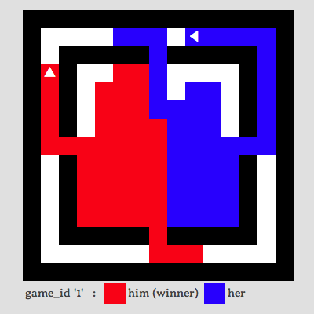

tron-engine
===========

Infrastructure for a Tron robot tournament, 
based on the 2010 U Waterloo Google AI Challenge.

See 

* http://tron.aichallenge.org/
* https://github.com/MarlboroCollegeComputerScience/tron-engine
* http://cs.marlboro.edu/courses/spring2014/workshop/home
* http://csmarlboro.org/tron/

The game
--------

The game is based on the light cycle arena in the 1982 Tron movie,
in which motorcyles zooming around in a room leave walls of light 
behind themselves, trying to box in the other player.

Here a referee progam (engines/round.py or engines/tournament.py) runs
two robot programs, sending them ascii maps and receiving back the
direction they choose to move, all through stdin and stdout.

There are a number of example bots and referees in various languages
at tron.aichallenge.org.

How do I use this?
------------------

You have several choices.

The quick and dirty way to run a robot is to execute it
from the command line, manually playing the role of 
the referee. This is the simplest way to see if a robot
will run at all.

For example

    $ ./bots/wallbot
    5 4              < You type this,
    #####            < giving a 5 columns x 4 rows map where 
    #1 2#            <   '#'  is a wall
    #   #            <   '1'  is you
    #####            <   '2'  is your opponent,
    3                > and the bot prints this (meaning SOUTH).

See the "protocol" section below for all the details of the
dialog between the referee and the bot.

To see one game in a terminal, use the ./run script, which
contains the syntax needed to start up a referee, 
set the bots, and choose a room. (See the text files
in the maps/ folder.) After editing ./run appropriately, 
just type

    $ ./run

Depending on the referee's options and the bot code, the moves from a
game can be saved, typically in the games/ folder, and diagnostics and
errors may be written to a files, typically in the logs/ folder.

The replay/ folder contains a web app that can replay saved games; visit
http://csmarlboro.org/tron and 
http://csmarlboro.org/tron/replay/tourney.cgi?name=test .

The tournament/ folder contains folders for various tournaments,
including scripts and results. See the files in tournament/test/ 
for an example.

The protocol
------------

On each turn, each bot gets a map (via its stdin) and must send back
(via its stdout) a direction (1, 2, 3, 4), within about 1 second.

If a bot produces anything else, or takes too long, it forfeits.

If both bots move into a wall, or move into each other or into
the same location, or both forfeit, then the game is a draw.

If one bot makes a legal move but the other doesn't then it wins
and the other loses.

The various starter packages and library files in the bots/ folder
(e.g. bots/tron.py, bots/c/tronlib.c) provide APIs for reading and
analyzing the map, logging errors and diagonstics, and sending the
move to the referee. See those file for the specifics - they're all a
bit different depending on the language style and preferences of the
authors.

The format that the referee uses to send the map to the bot 
is the same on each turn, and and is also the same as the 
files in the maps/ folder. For example, maps/ring.txt looks like

    15 15
    ###############
    #    2        #
    # ##### ##### #
    # #         # #
    # #         # #
    # #         # #
    # #         # #
    #             #
    # #         # #
    # #         # #
    # #         # #
    # #         # #
    # ##### ##### #
    #        1    #
    ###############

The first line gives the width and height of the map.
Then each of the following (height) lines has in its
first (width) characters the layout of the current room.

The tiles of the grid are

    '1'        'me', the current player
    '2'        'them', the opponent
    '#'        wall
    ' '        floor

The referee sends each player the board from their point
of view. So for example at the same time that the player
near the bottom of the map gets the board above, the
other player near the top receives

    15 15
    ###############
    #    1        #
    # ##### ##### #
    # #         # #
    # #         # #
    # #         # #
    # #         # #
    #             #
    # #         # #
    # #         # #
    # #         # #
    # #         # #
    # ##### ##### #
    #        2    #
    ###############

The entire map, including the "width height" dimensions,
is read on stdin by each bot on every turn.

About
-----

The Programming Workshop course at Marlboro College
is using this as a group exercise.

Questions? Ask Jim.

Jim Mahoney | cs.marlboro.edu | MIT License | Feb 2014

